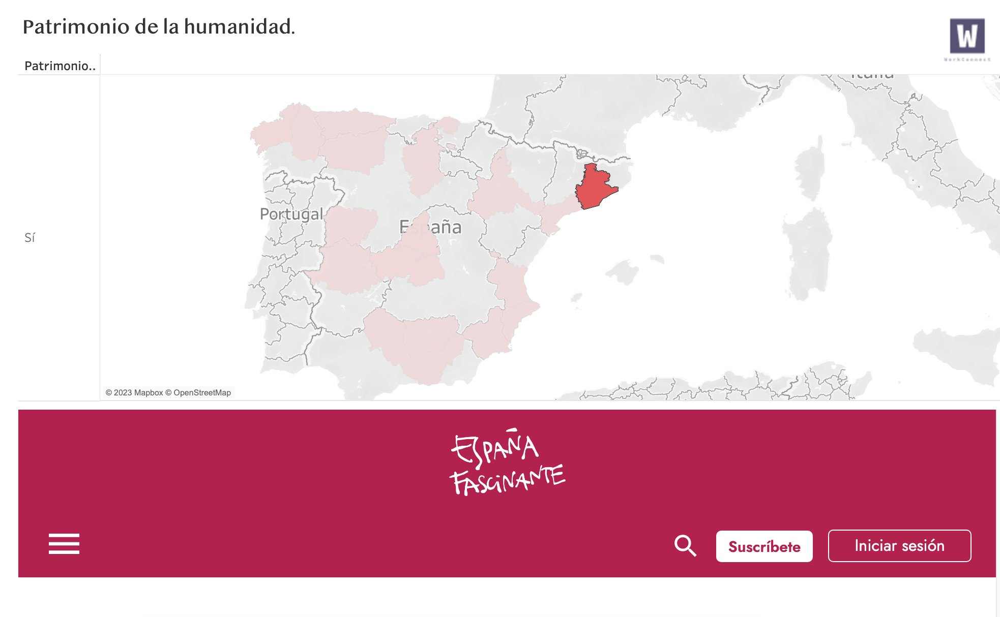
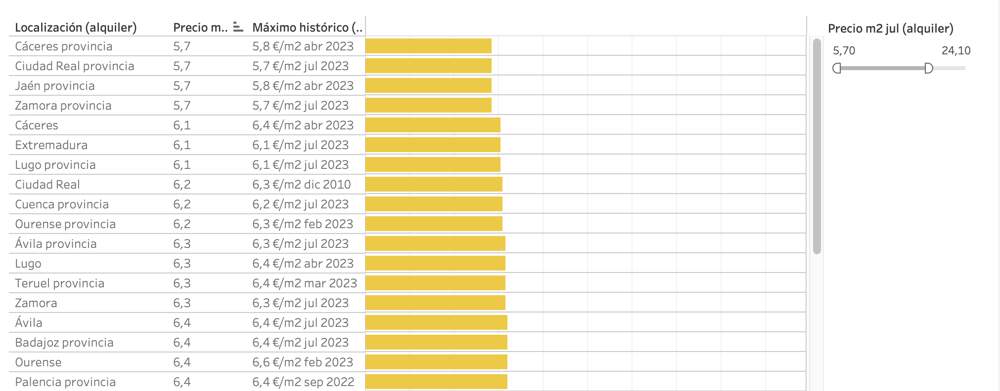
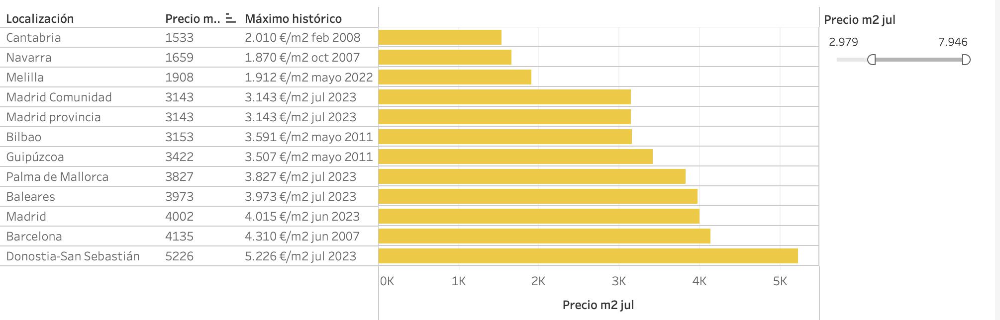
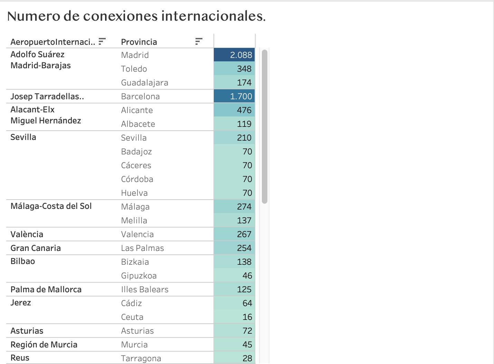
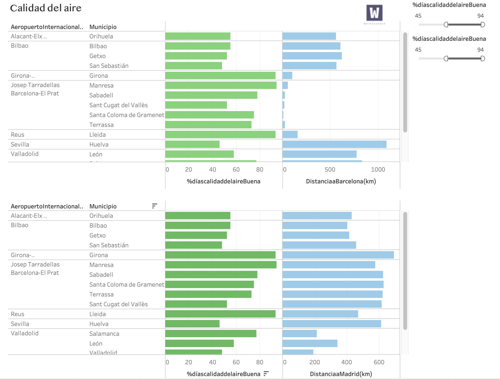
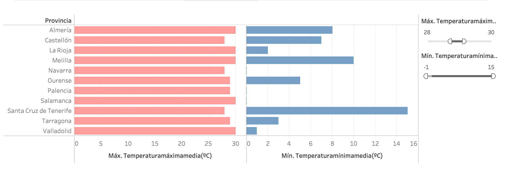
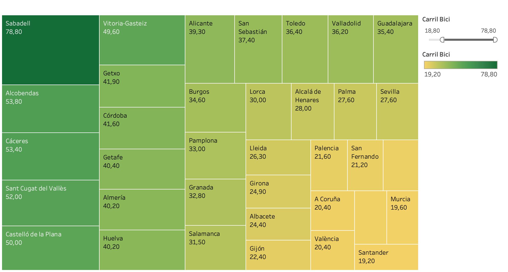

[![LinkedIn][linkedin-shield]][linkedin-url]
<!-- PROJECT LOGO -->

# Project_visualizacion

### Proyecto WorkConnect

  

## CONTENIDO 📑
[1 - Objetivo ](#O) 
[2 - Enrequecimiento del dato](#ENR)  
[3 - Cuadros de Mando (Dashboards) ](#DS)  
&nbsp;&nbsp;&nbsp;&nbsp; [3.1 - Experiencia cultural](#CT)  
&nbsp;&nbsp;&nbsp;&nbsp; [3.2 - Vivienda](#CT)  
&nbsp;&nbsp;&nbsp;&nbsp; [3.3 - Conexiones internacionales](#CI)  
&nbsp;&nbsp;&nbsp;&nbsp; [3.4 - Calidad del aire](#AIR)  
&nbsp;&nbsp;&nbsp;&nbsp; [3.5 - Temperatura](#TEM)  
&nbsp;&nbsp;&nbsp;&nbsp; [3.6 - Carril bici](#BICI)  
[4 - Conclusiones ](#CONC)  

## 1 - OBJETIVO <a name="O"/>   

- Realizar la visualización de las diferentes variables obtenidas a partir de una ETL concreta. Utilizamos la ETL de teletrabajo trabajada en el proyecto anterior.

- Contruir diferentes tipos de gráficos capaces de explicar de la forma más visual posible el comportamiento de las diferentes métricas.

- Realizar una exposición en Tableu a partir de los gráficos obtenidos y mostrar una serie de conclusiones.

## 2 - Enrequecimiento del dato.<a name="ENR"/> 

- 2.1 Se procede a exportar los datos con Python del proyecto anterior con pandas.

- 2.2 Se limpian los valores y se convierten los numeros en tipo numerico para operar

- 2.3 Se procede a enriquecer el dato, escreapeando idealista, alquileres en España.

- 2.4 Se guardan los nuevos CSV.

- 2.5 Se crea nueva base de datos en SQL.

## 3 - Cuadros de Mando (Dashboards)  <a name="DS"/>

### 3.1 Experiencia cultural <a name="CT"/>

En el primera historia del proyecto podemos ver:

- Un mapa geografico de España donde se puede ver las comunidades autonomas con Patrimonio de la humanidad

- En el cuadra inferior se dirige a una pagina web donde muestra la experiencia cultural y de ocio por cada ciudad al seleccionar. 

### 3.2 Vivienda <a name="CT"/>

En el CM Vivienda podemos ver dos apartados de venta y alquiler por m2:

- Un gráfico de barras de los por m2.

- Maximos histórico.

- Barra de filtro para poner el rango deseado.

### 3.3 Número de conexiones internacionales. <a name="CI"/>

En el CM podemos ver:

- Una tabla de realtado.

- Figuran el numero de conexiones internacionales.

- La provincia.

- El aeropuerto más cercano.

### 3.4 - Calidad del aire.<a name="AIR"/>

En el CM Calidad del aire podemos ver:

- Podemos obdervar dos graficos de barras.

- Grafico con la calidad de aire buena.

- Filtro para poner el porcentaje de calidad de aire.

- Grafico de cercania a Madrid y a Barcelona.

- Aeropuerto internacional mas cercano.

### 3.5 - Temperatura.<a name="TEM"/>

En el CM Calidad del aire podemos ver:

- Podemos obdervar dos graficos de barras.

- Temperatura maxima.

- Temperatura minima.

- Filtro de temperatura para seleccionar el rango deseado. 

### 3.6 - Carril bici.<a name="BICI"/>

En el CM carril bici podemos ver:

- Podemos obdervar un grafico de lineas.

- Provincias

- Km de carril bici.

- Filtro de km para seleccionar el rango deseado. 

## 2 - CONCLUSIONES 📊<a name="CONC"/> 
- 15 Ciudades de España son patrimonio de la humanidad.

- El precio de alquiler mas barato se encuentra en las ciudades de Cáceres, Ciudad Real, Jaén y Zamora.

- El precio de alquiler mas caro se encuentra en las ciudades de Barcelona, Madrid y Baleares.

- El precio de venta mas barato se encuentra en las ciudades de Ciudad Real, Cuenca y Jaen.

- Las ciudades con mas vuelos internacionales Madrid y Barcelona.

- Las ciudades con mejor calidad del aire, cerca de Madrid son Valladolid y Salamanca.

- Las ciudades con mejor calidad del aire, cerca de Barcelona son Canta Coloma, Sant Cugat, Sabadell, Manresa

- Burgos es la tiene la media de temperatura mas fria en los meses de invierno.

- Almeria y Melilla tienen una temperatura entre el 30 maximos y 10 de minimos.

- Sabadell es la ciudad con más km de carril bici.  

<!-- MARKDOWN LINKS & IMAGES -->
<!-- https://www.markdownguide.org/basic-syntax/#reference-style-links -->
[linkedin-shield]: https://img.shields.io/badge/-LinkedIn-black.svg?style=for-the-badge&logo=linkedin&colorB=555
[linkedin-url]: https://www.linkedin.com/in/esteban-cardona-60163685/